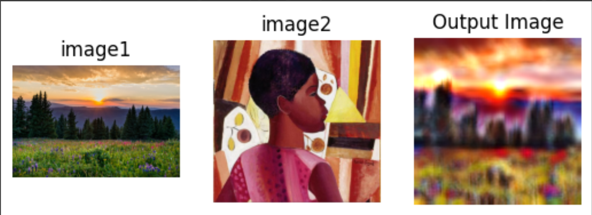
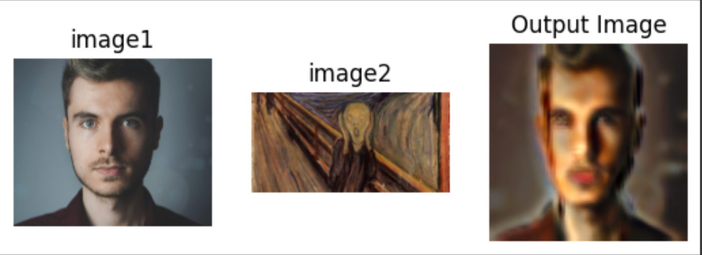

# Implementation and enhancement of the model "Learning Graph Neural Networks for Image Style Transfer"

### Description:
This project is an **simple Pytorch implementation** of the paper "Learning Graph Neural Networks for Image Style Transfer"

### Architecture:

### Re-implementation:

Blocks of code that we have implemented :

+ Encoder : VGG19 
+ Image2patch 
+ Knn graph constructor
+ GATv2
+ Patch2feat
+ AdaIN
+ Pyramid feature

### Improvements:

+ Using GATv2 instead of GAT since the graph structure is similar to graph structure of “SYNTHETIC BENCHMARK: DICTIONARY LOOKUP” in GATv2.
+ We define a threshold to decide to construct an edge or not instead of KNN.
+ Improving Patch2Feat with Feature Pyramid network.

### Results: NOT THE DESIRED OUTPUT

### Conclusion:

+ The operation proposed required a tremendous amount of 
GPU mem
+ Even though our implementation didn’t get the desired 
results, We think that if we have enough GPU for smaller 
patch stride the output would be better.

### Future works:
+ Invest on GPU power
+ Finding improvement in order to reduce the memory requirements (different encoder).
+ Implement deformable graph convolutional operation